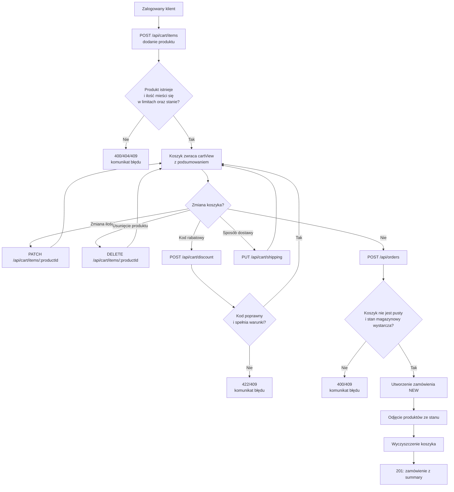

# BeanShop: architektura

Aplikacja jest celowo mała, żeby dało się ją ogarnąć w jeden dzień szkolenia.

```
public/            frontend: czysty HTML + JS (bez frameworka), strony: /, /login, /register, /cart, /orders
src/server.ts      start serwera (PORT, domyślnie 3000)
src/app.ts         Express: routing /api/*, pliki statyczne
src/routes/        endpointy REST: auth, products, cart, orders, testApi
src/domain/        logika biznesowa bez HTTP: pricing (ceny, dostawa), discounts (kody), password, orderStatus
src/store.ts       baza w pamięci + dane startowe (produkty, konta)
tests/unit/        Vitest: testy jednostkowe domeny
tests/api/         Playwright (request): testy API
tests/e2e/         Playwright: testy UI, page objects w tests/e2e/pages
tests/support/     klient API, budowniczowie danych, schematy kontraktów (zod)
```

## Przepływ "złóż zamówienie"

1. `POST /api/auth/login` zwraca token (Bearer) i ustawia cookie `sid`.
2. `POST /api/cart/items` dodaje produkt; `PATCH /api/cart/items/:id` zmienia ilość.
3. `POST /api/cart/discount` stosuje kod; `PUT /api/cart/shipping` wybiera dostawę.
4. Każda odpowiedź koszyka zawiera `summary` wyliczane przez `src/domain/pricing.ts`.
5. `POST /api/orders` tworzy zamówienie NEW, zdejmuje towar ze stanu, czyści koszyk.
6. `POST /api/orders/:id/pay`, `/cancel` oraz `PATCH /api/orders/:id/status` (admin) zmieniają status zgodnie z `src/domain/orderStatus.ts`.

## Diagram przepływu: od dodania produktu do złożenia zamówienia



## API testowe

Włączane zmienną `ENABLE_TEST_API=1` (Playwright robi to automatycznie):

- `POST /api/test/reset`: przywraca dane startowe.
- `POST /api/test/clock` `{ "now": "2026-11-30T23:59:00+01:00" }`: ustawia czas serwera (np. ważność kodów); `{ "now": null }` przywraca czas systemowy.
